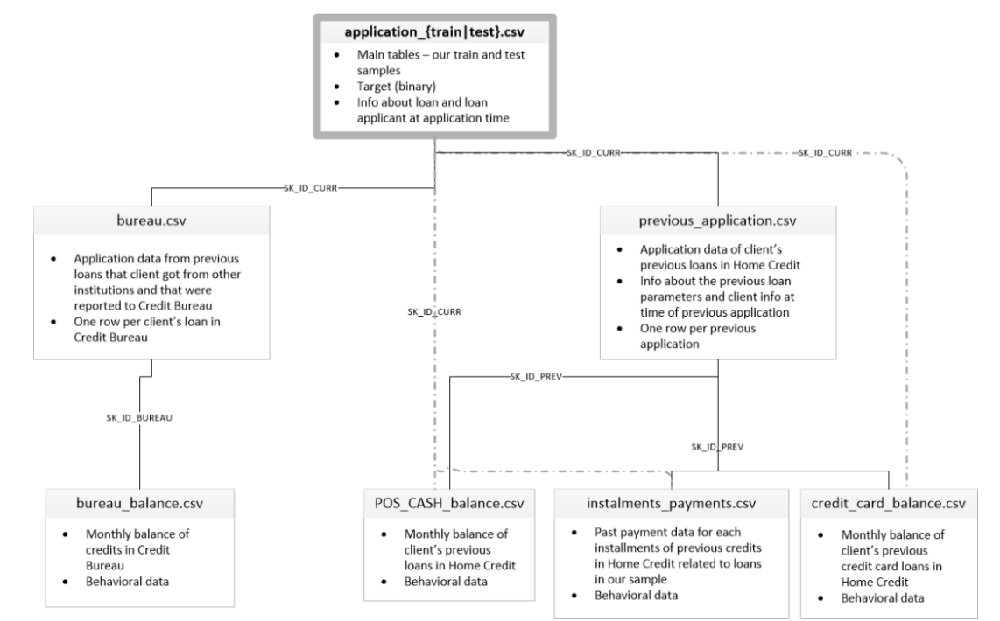

# Projeto módulo 5 - Crédito para Financiamento de Imóveis

____________

## Contextualização

A PyCoders Ltda., cada vez mais especializada no mundo da Inteligência Artificial e Ciência de Dados, foi procurada por uma fintech para desenvolver um projeto de concessão de crédito para imóveis. Nesse projeto, espera-se a criação de valor que **discrimine ao máximo** os **bons pagadores** dos **maus pagadores**. 

Para isso, foi disponibilizada uma base de dados com milhares de casos de **empréstimos do passado** com diversas características dos clientes. 

Entrega: um modelo com a **melhor performance** possível.

Métrica de performance (inicialmente proposta): **ROC-AUC.**

## Base de Dados

Serão utilizadas bases de dados com **informações cadastrais, histórico de crédito e balanços financeiros de diversos clientes**. 

O conjunto de dados está dividido em **treino e teste**, todos no formato csv. 

Toda a modelagem, validação e avaliação deve ser feita em cima do conjunto de **treino**, subdividindo tal base como a squad achar melhor. 

Existe também os das variáveis explicativas, para ajudar no desenvolvimento do projeto. 

Serão necessários diversos cruzamentos e vocês estão livres para usar os dados da maneira que acharem mais conveniente.

[Clique aqui](https://drive.google.com/file/d/17fyteuN2MdGdbP5_Xq_sySN_yH91vTup/view) pra baixar os dados (eles estão disponiveis no arquivo zipado `credito-imoveis.zip`).

## Regras de Entrega

Deve ser entregue um arquivo csv com as **predições** para a base de teste.

Essa base deverá ser um Data Frame com duas colunas: a primeira sendo o **SK_ID_CURR** e a segunda a **probabilidade de inadimplência.**

### IMPORTANTE!

Entregar as predições com a **probabilidade da inadimplência ocorrer**, não a classe predita.

Além do arquivo com as predições, claro, entreugem também o notebook com o código utilizado. É importante que ele tenha:

- (i) a análise exploratória e construção das variáveis explicativas;

- (ii) a análise de modelagem, mostrando o processo das avaliações dos modelos e os motivos das decisões tomadas sobre qual modelo usar.

## Dicas

Explorar o conceito das variáveis: existe risco de imagem uma empresa utilizar variável de sexo para determinar risco de crédito? Vale a pena trazer a variável para o modelo?

Criar novas variáveis usando as variáveis que já estão na base: criatividade!

Qualquer dúvida, só me chamar! ;)

## application_{train|test_student}.csv  

o This is the main table, broken into two files for Train (with TARGET) and 
Test_Student (without TARGET).
o Static data for all applications. One row represents one loan in our data sample.
## bureau.csv   
All client's previous credits provided by other financial institutions that were reported    
to Credit Bureau (for clients who have a loan in our sample).  
For every loan in our sample, there are as many rows as number of credits the client 
had in Credit Bureau before the application date.
## bureau_balance.csv  
Monthly balances of previous credits in Credit Bureau.   
This table has one row for each month of history of every previous credit reported to 
Credit Bureau – i.e the table has (#loans in sample * # of relative previous credits * 
\# of months where we have some history observable for the previous credits) rows.
## POS_CASH_balance.csv   
Monthly balance snapshots of previous POS (point of sales) and cash loans that the 
applicant had with Home Credit.   
This table has one row for each month of history of every previous credit in Home 
Credit (consumer credit and cash loans) related to loans in our sample – i.e. the table    
has (#loans in sample * # of relative previous credits * # of months in which we have 
some history observable for the previous credits) rows.
## credit_card_balance.csv   
Monthly balance snapshots of previous credit cards that the applicant has with Home 
Credit.   
This table has one row for each month of history of every previous credit in Home 
Credit (cons  
has (#loans in sample * # of relative previous credit cards * # of months where we 
have some history observable for the previous credit card) rows.
## previous_application.csv   
All previous applications for Home Credit loans of clients who have loans in our 
sample.   
There is one row for each previous application related to loans in our data sample.
## installments_payments.csv  
Repayment history for the previously disbursed credits in Home Credit related to the 
loans in our sample.   
There is a) one row for every payment that was made plus b) one row each for 
missed payment.  
One row is equivalent to one payment of one installment OR one installment 
corresponding to one payment of one previous Home Credit credit related to loans 
in our sample.  
## HomeCredit_columns_description.csv  
This file contains descriptions for the columns in the various data files